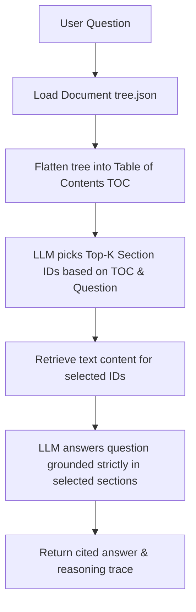

# ⚖️ GST Copilot — Vectorless Regulatory RAG

**GST Copilot** is a state-of-the-art web application designed for reasoning over complex Indian regulatory documents (specifically GST circulars and acts) using a **Vectorless RAG** approach. 

Traditional RAG requires chunking documents, embedding them into vectors, storing them in a vector database, and querying them based on cosine similarity. Instead, GST Copilot operates on a hierarchical document tree parsed directly from raw PDFs, allowing LLMs to reason over the table of contents and select exact sections to answer queries with precise citations. 

*No embeddings, no vector database—just pure LLM structural reasoning.*

---

## 🚀 Key Features

* **Tree-Based Document Architecture**: Raw PDFs are parsed into structured hierarchical JSON trees where each section is a node containing title, summary, and page ranges.
* **Vectorless RAG Retrieval**: When you query, the LLM reasons over the Document Tree's Table of Contents (TOC) to identify the most relevant section IDs before requesting the underlying content.
* **Inline Citations**: Generates grounded, detailed answers citing exact sections in the format `[Section ID]`.
* **Dynamic API Key Entry**: Configure your Groq API key securely directly from the UI sidebar or set it in your `.env` file.
* **Interactive Tree Explorer**: Browse and read parsed document sections hierarchically directly in the browser interface.
* **Premium Dark Theme**: Polished glassmorphic dark interface with Outfit and Plus Jakarta Sans typography.

---

## 📁 Repository Structure

```text
regulatory-rag/
├── app.py                  # Main Streamlit web application
├── style.css               # Premium custom CSS stylesheet
├── requirements.txt        # Python dependency specifications
├── .env.example            # Environment variables template
├── data/
│   ├── raw_pdfs/           # Directory for input PDFs grouped by domain (e.g. gst/)
│   └── trees/              # Saved hierarchical JSON document trees
├── src/
│   ├── config.py           # Configuration parameters and LLM settings
│   ├── llm.py              # Litellm completion handler with retry logic
│   ├── tree_builder.py     # Script to parse raw PDF pages into tree JSON structure
│   └── vectorless.py       # Core vectorless retrieval and response reasoning logic
└── scripts/
    ├── build_trees.py      # Build tree JSON files for all raw PDFs in raw_pdfs/
    └── smoke_test.py       # Simple API verification script
```

---

## 🛠️ Installation & Setup

### 1. Clone the repository
Ensure you are in the project folder:
```bash
cd regulatory-rag
```

### 2. Set up virtual environment
```bash
python3 -m venv venv
source venv/bin/activate
```

### 3. Install dependencies
```bash
pip install -r requirements.txt
```

### 4. Configure environment variables
Copy the `.env.example` to `.env`:
```bash
cp .env.example .env
```
Open `.env` and set your `GROQ_API_KEY`:
```env
GROQ_API_KEY=gsk_...
```
*(Alternatively, you can skip editing `.env` and paste your key in the Streamlit UI sidebar.)*

---

## 📖 Usage

### Running the Web App
Start the Streamlit application:
```bash
streamlit run app.py
```
This will open the app in your browser at `http://localhost:8501`.

### Generating New Document Trees
To parse your own PDF files:
1. Place the PDF in `data/raw_pdfs/gst/` (or create another subfolder like `incometax/` or `rbi/`).
2. Run the tree builder script:
   ```bash
   python scripts/build_trees.py
   ```
3. Once the tree JSON is created in `data/trees/`, it will automatically appear as a selectable document in the Ask and Explore Tree tabs.

---

## 🧠 Under the Hood: How Vectorless RAG Works



1. **Section Hierarchy**: The PDF text is segmented. The LLM processes chunks and identifies main headers, creating a JSON map of sections.
2. **Table of Contents (TOC) Reasoning**: The system flattens the tree into a clean list of section headers and summaries.
3. **Retrieval**: The query LLM is shown the list of headers and the user's question, picking the most relevant ones.
4. **Answering & Grounding**: The system extracts the full text of those selected sections and prompts the LLM to answer the question *only* using that context, citing sources inline.
